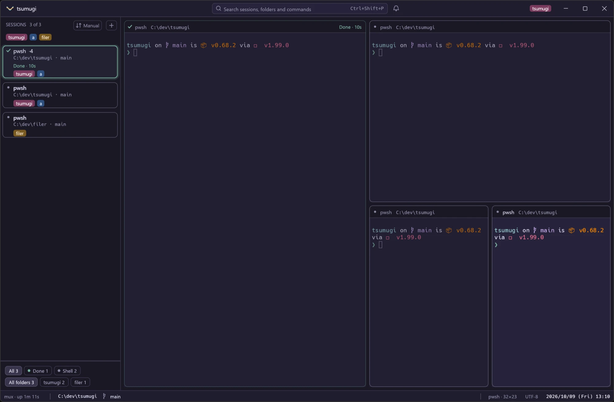
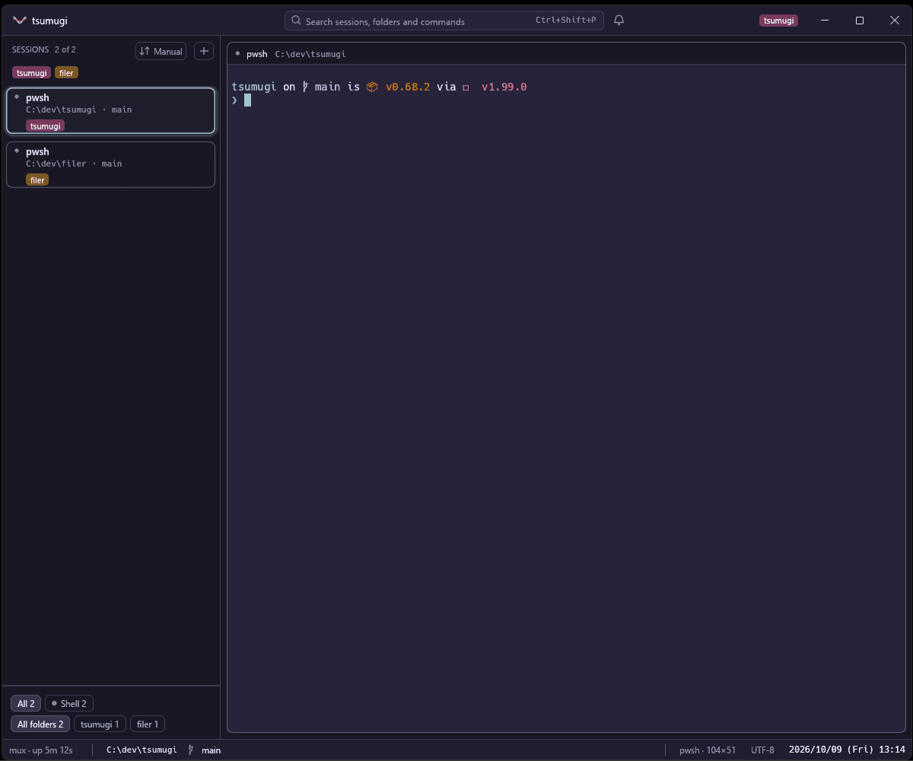
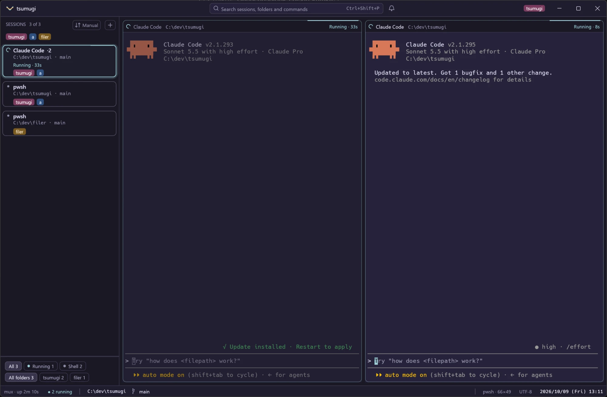

# tsumugi

A terminal built for running many Claude Code and other AI CLI sessions side
by side: vertical tabs, split panes, and a glance at which session is waiting
for you. Rust + egui, Windows first, with macOS and Linux on x86_64 and ARM64.

**Status: early.** A window with one shell in it, nothing more yet. The first
version's scope is in [docs/v1-scope.md](docs/v1-scope.md).

## What it looks like



Split a pane with the keys, then drag it by its header to put it somewhere
else: onto the middle of another pane to trade places, onto an edge to sit on
that side.



Each session's state shows on its card and in its pane's heading, so two
Claude Code sessions side by side say which one is still working:



```sh
cargo run -p tsumugi
```

On Windows, a build with the newer ConPTY beside it is on the Actions tab
(the **Build** workflow, artifact `tsumugi-windows-x64-…` or `-arm64-…`). A
local build gets it with `pwsh -File scripts/fetch-conpty.ps1 -Dest target\debug`;
without it the pane runs on the older ConPTY built into Windows, which breaks
`Esc` in lazygit and the like.

Sessions live in a background server (`tsumugi server`, which the window
starts by itself), so closing the window leaves them running; `tsumugi ls`
lists them (number, state, program, folder, title, what it said, tags). With
no session and nothing to bring back, the window shows **Start your first
session**: the folders to start in, Enter for the first, and the offer of
Claude Code's hooks. `tsumugi new [FOLDER] [--tag TAG] [-- claude]` starts one in a tab
of its own (the server too, if it is not running) and prints its number;
`tsumugi attach NAME` opens a window on one, named by its number, folder,
program or tag. On Windows the server runs from a copy of the exe kept in
`%LOCALAPPDATA%\tsumugi\server\`, so a rebuild or an update can replace
`tsumugi.exe` while sessions run. A window that finds a server of another
version says tsumugi was updated and offers, on Enter, to restart the
server -- the tabs are written down first -- and brings every one back.
`restart_after_update = true` under `[general]` (Settings, General) does it
without asking. The sidebar rings each one in its state's
colour, with a mark that says it without the colour: cyan and a turning arc
while an agent works, yellow, breathing, and a clock when it wants you, a
thin yellow ring and a dotted circle when its output has stopped for 10
seconds while a program runs (`[sessions] quiet`, 0 to turn the guess off),
green and a tick when it is done, red and a triangle for an error. A plain
shell -- no Claude Code in it, and nothing that told tsumugi -- is grey, with
no words: running and done say nothing about a shell. Each pane carries the
same ring and mark in its heading. `Ctrl+Shift+U` (Cmd+Shift+U on
macOS) goes to the session that has waited longest.

`Ctrl+Shift+Y` (Cmd+Shift+Y on macOS, or **List ›** at the sidebar's foot)
lists every session waiting for you: what it said, how long it has waited,
what it asks about as its screen says it (Claude Code's "Bash command" and
the command, the file to edit), and the numbered choices as buttons. Each row has a tick;
**Yes to N** types `1` into every ticked menu whose first choice is "Yes",
**No to N** types the choice that starts with "No". A menu without such a
choice, or a session with no menu on its screen, is left alone. When it asks
to run one Bash command, **Always allow…** shows the rule (`Bash(npm run
test)`) and the file it goes in -- the project's `.claude/settings.local.json`,
kept on this machine and out of git, the old one kept beside it -- and, once
confirmed, writes it and says yes: Claude Code runs that exact command without
asking from then on. The same
panel's other page, **Recently closed** (also in the search box), keeps the
last 30 sessions that ended -- when, how, the tokens its conversation used,
and the last 12 lines on its screen -- with **Resume** (Claude Code's
conversation again, in a new tab in its folder) or **Start again**. The list
is `closed-sessions.json` beside the state file.

A tab's right-click menu has **Note…**: a line of your own (what the tab is
for), shown in quotation marks on its card and kept across restarts.

### After a restart

The server writes the tabs down as they change: each tab's splits, and per
pane its folder, its shell and the Claude Code conversation running in it.
After a restart of the machine, the first window starts them all again and
types `claude --resume <conversation>` where Claude Code ran. The file is
`%LOCALAPPDATA%\tsumugi\state` on Windows, `~/.local/state/tsumugi/state`
on Linux, `~/Library/Application Support/tsumugi/state` on macOS
(`TSUMUGI_STATE` overrides).

On Windows a shell's folder can only be known when the shell says it, so add
the hook to PowerShell 7's profile; without it a tab comes back in the folder
it was opened in:

```powershell
tsumugi shell-hook pwsh >> $PROFILE
```

(`tsumugi shell-hook bash` and `zsh` exist too; on Linux and macOS the folder
is read from the system anyway.) The hook also marks where each prompt starts
(OSC 133;A), which `Ctrl+Shift+Up` / `Down` jump between, and each command's
exit code (133;D) and output (133;C; bash and zsh) for the command blocks
below; PowerShell 7 started by tsumugi on Windows gets all of it without it.
A hook installed before 0.64 marks prompts only: add it again for the rest. In PowerShell the mark wraps the
`prompt` already there, so put the hook after `starship init` or the like.

### When you are not looking

While the window does not have the keyboard, a session that starts waiting,
hits an error, or finishes after running a minute or more shows the system's
notification, and the ones waiting or in error are counted on the taskbar
button (on Windows a gold number over the icon, red once one has failed;
elsewhere the window title
starts with it, `(2) …`). Coming back to the window clears the number. The bell
beside the search box at the top keeps the same list; `Ctrl+Shift+N`
(`Cmd+Shift+N` on macOS) opens and closes it.

The notification says `<folder> is waiting for you` (or `failed`, `is
done`), the work's name and what it said below; on Windows one per session,
the newer replacing the older, with **Open** and **Later**. Clicking it (or
Open) goes to that session's pane and brings the window to the front (Windows and Linux; macOS's AppleScript notifications cannot
say they were clicked). With several windows open, only the one that had the
keyboard last tells, and none does while you are at any of them. Right-click
a tab and choose **Mute notifications** to keep it to the bell: no system
notification and no number for it, and the tab shows a struck-through bell.

On Windows the notification needs the app's name registered for the current
user; tsumugi writes it at the first notification
(`HKEY_CURRENT_USER\Software\Classes\AppUserModelId\uchmk.tsumugi`). On
Linux it goes through `notify-send` (a click is seen with libnotify 0.7.12 or
later), on macOS through AppleScript. Which
states tell in which way is `[notify]` in the settings (below); by default
the taskbar does not flash.

Away from the machine, `[notify] webhook` (Settings, Notifications, WHILE YOU
ARE AWAY) sends a session that has waited `webhook_after` seconds (2 minutes
by default) while no tsumugi window is looked at -- an ntfy topic's address
(`https://ntfy.sh/my-topic`, the phone's notification), a Slack incoming
webhook (`webhook_format = "slack"`) or any address taking JSON (`"json"`:
`title`, `message`, `folder`). The server sends it, once a wait, through the
system's `curl`, so it works with the window closed; muted sessions and quiet
tags are not sent.

`[notify] spend_day` and `spend_block` (Settings, Notifications, WHAT IT
COSTS) say once when the day's estimated cost, or a 5-hour block's, passes
that many dollars: a toast, and the system's notification while the window
is not looked at. The estimate is the token counts at API prices (below), so
on a Pro or Max plan it measures how hard the plan is used, not a bill.

### The input box

`Ctrl+I` (`Cmd+I` on macOS) opens a box at the foot of the pane with the
keys, inside its card, to write a prompt in as in any editor: `Enter` is a
new line, `Ctrl+Enter` sends it to the pane whole (pasted, then Enter), so
there is no fight with `Shift+Enter`. Files dropped on the window become
chips, with their sizes, whose paths go with the prompt; `Ctrl+V` with an
image on the clipboard (a screenshot) saves it as a PNG in the settings
folder's `attachments` and adds it the same way. `↑` brings back what was sent (kept between runs), a draft
stays with its session, and choosing a tag under **To** sends the same
prompt to every session wearing it; **+ Sessions** there picks other
sessions to get it as well as the pane, or **Every session**. **Prompts…**
keeps a prompt under a name and puts one back into the draft; `{folder}`,
`{project}` and `{branch}` in it become each receiving session's when it is
sent. They are kept in `prompts.toml` beside the settings (and go with an
export). `Esc` gives the keys back to the pane.

### In a pane's output

Hold `Ctrl` (`Cmd` on macOS) and the web addresses and file paths on the
screen are underlined under the pointer; a click opens them. An address
goes to the browser; a path (`src/main.rs:120:5`, `./notes.md`,
`~/dev/x`, `C:\work\a.txt`, read from the session's folder) opens in
`[open] file` at that line and column, a folder in the system's file
manager. An address with characters a shell would read (`"`, `&`, `|`,
`;` …) is not opened.

A link a program writes as one (OSC 8: `ls --hyperlink=auto`, `gcc`,
`delta`, `cargo` in some terminals) has a dotted line under it all the time,
since its text need not look like an address; `Ctrl`+click opens what it
points at. A `file://` link opens the file, wherever the folder is.

`Ctrl+=` and `Ctrl+-` (`Cmd+=`, `Cmd+-`) make the letters bigger or
smaller, a point at a time, in every pane, for as long as the window is
open; `Ctrl+0` puts back the size the settings have. `Ctrl+Shift+-` still
reaches the shell as readline's undo.

`Ctrl+Shift+M` (`Cmd+Shift+M`) is **copy mode**: a gold box of its own over
the pane's output, which gets no keys meanwhile. The arrows or `hjkl` move it
(past the top or bottom, the scrollback moves under it), `PgUp`/`PgDn` a
page, `g` and `G` to the oldest and newest line, `0`/`Home` and `$`/`End`
to the line's ends. `v` or `Space` starts a selection there, which follows
the box; `y` or `Enter` copies it -- or the box's whole line when nothing is
selected -- and leaves; `Esc` or `q` leaves without copying. The window's
own keys still work.

`Ctrl+Shift+Up` and `Ctrl+Shift+Down` (`Cmd+Shift+Up` / `Down`) scroll the
pane to the prompt above or below the view's top, where the shell marks its
prompts (OSC 133;A, which the shell hook adds; Windows Terminal's and
WezTerm's shell integration lines do too).

Where the shell also says how each command ended (133;D), every command is a
**block**: a thin bar in the pane's left margin beside the command and its
output, green when it succeeded and red when it failed. `Ctrl+Shift+L`
(`Cmd+Shift+L`) copies the last command's output (the rows from its 133;C,
or after its prompt line when the shell does not send C).

**Pictures** show in the pane where a program prints them, in any of the
three ways terminals take them: sixel (`img2sixel`, `chafa -f sixel`),
kitty's graphics protocol (`kitten icat`, yazi, `chafa -f kitty`) and
iTerm2's inline images (`imgcat`, `wezterm imgcat`). A picture sits over the
cells it covers and scrolls, clears and goes with them, through the mux too
(closing and opening the window keeps them). PNG, JPEG and GIF (its first
frame); a picture is cut down to 4000 px a side. Kitty's shared memory and
animation are not taken; its files and temporary files are. tsumugi answers
the questions programs ask first (the pane's size in pixels, and that
it does sixel), so they pick the right size by themselves.

`Ctrl+Shift+F` (`Cmd+F`) **finds in the pane**: a bar at its top right finds
what is typed as plain text, from the newest line back, and selects it on
screen (ignoring case unless the text has a capital). `Enter` or **↑** goes on
to the older match, `Shift+Enter` or **↓** to the newer; it says when it ran
off the end and started again, or that nothing matched. `Esc` or **×** closes
it; no key typed in it reaches the shell.

A **paste is asked about** before it goes when it could run more than was
meant: several lines into a program that did not ask for bracketed paste
(where each line break is an Enter), or 5 KB or more anywhere. The dialog
shows its first lines; `Enter` pastes, `Esc` drops it. Claude Code and the
shells that ask for bracketed paste get several lines without a word. Both
are switches in Settings → General → Pasting (`warn_multiline_paste`,
`warn_large_paste`).

`Ctrl+Shift+O` (`Cmd+Shift+O`) shows **All sessions**: every session on one
page, those waiting for you first, then errors, running and done, each with
its state, folder and branch, tags, tokens and its last two lines. The arrows
and `Enter`, or a click, go to one.

### The status bar

Along the bottom: the server, how many sessions wait, run or failed, and the
folder and branch of the pane with the keys -- with `↑N` for commits not
pushed, `↓N` for commits to pull, and the branch's pull request (`PR #42 ✓`,
green when its checks pass, red when one failed, cyan while they run; a
click opens it). The pull request needs the GitHub CLI (`gh`) signed in.
On the right, Claude Code's tokens -- the focused session's conversation
and today's in all -- read from the transcripts under `~/.claude/projects/`
(`CLAUDE_CONFIG_DIR` moves them); the totals leave out the cache's reads,
which the tooltip shows. `≈$0.42` beside them is what those tokens would
cost on the API, at each model's prices -- Anthropic's own as of 2026-09-25,
with cache writes at 1.25 times the input (2 times for the hour-long cache);
`[prices."model-id-start"]` with `input`, `output` and `cache_read` (dollars
per million) changes them or adds a model. A Pro or Max plan is not billed
this way: it is what the same work would cost. `5h 1.2M · resets 14:00` is Claude Code's usage
window: it opens at the hour of the first answer after the last one closed
and lasts five hours, worked out from the same transcripts. How much a window
allows depends on the plan, which tsumugi cannot read, so it says what was
used and when the window closes.

The character set of the pane with the keys is beside the clock. Off Windows,
a click picks another for that pane -- Shift_JIS, EUC-JP, ISO-2022-JP, GBK,
Big5, EUC-KR, windows-1252 -- for a file in it shown with `cat` or an old
machine reached with `ssh`: what the program writes is read in it and what is
typed is sent in it, the pane's heading says which, and it is kept across
restarts. On Windows ConPTY hands over UTF-8 whatever the program wrote, so
there is nothing to pick.

A card in a git repository shows what its session has changed and not
committed -- `+120 −8` lines, or `3 new` files -- with the list of files
under the pointer; a click there (or **Changes not committed here** in the
search box) shows the diff, each file under its heading, added lines green
and removed ones red, the files git does not know yet at the end.

**Start in parallel** (the search box) takes a repository and a prompt for
each piece of work: each gets a git worktree beside the repository on a
branch of its own (`tsumugi/1007-1432-1`, `-2`, …) and a tab where Claude
Code starts on its prompt. A tab on a branch other than `main` has **Create
a pull request** in its menu: the branch pushed and `gh pr create --fill`
run, the pull request opened in the browser.

`Ctrl+Shift+I` (`Cmd+Shift+I` on macOS, iTerm2's key) sends what is typed to
every pane of the tab -- **TYPING INTO ALL** on each heading -- until it is
pressed again. **Save the output to a file** in the tab's menu (or the search
box) writes the pane's whole scrollback as text to Downloads.

When a waiting session has a menu of numbered choices on its screen --
Claude Code's "Do you want to proceed? 1. Yes 2. … 3. No" -- its card shows
them as buttons; a click types the number there, so a permission is given
without leaving the pane you are in.

Rest the pointer on a tab in the sidebar (or the rail) to see the last
lines of its session -- the one that wants you, in a tab of several --
without going there.

### Splits

`Alt+Shift++` splits the pane with the keys to the right (`+` is Shift and
`=` on a US keyboard, Shift and `;` on a JIS one), `Alt+Shift+-`
below (`Cmd+D` and `Cmd+Shift+D` on macOS); `Alt+Arrows` move between them,
`Alt+Shift+Arrows` move the nearest divider (`Cmd+Ctrl+Arrows` on macOS)
and `Ctrl+Shift+Z` zooms one. Drag a pane by its header onto another: the
middle trades their places, an edge puts it on that side. A pane narrower
than 20 columns or lower than 4 rows folds into a strip with its name and
state. Dropped on the sidebar, a pane leaves its split for a tab of its own.
With the keys: `Ctrl+Shift+X` swaps the pane with the next one in the tab,
`Ctrl+Shift+E` gives every pane the same room (three side by side a third
each) and `Ctrl+Shift+J` takes the pane to a tab of its own and shows it
(`Cmd+Shift+X`, `E`, `J` on macOS).
Zoomed, the heading says ZOOM, and a pane hidden behind that waits is said
at the bottom right with the key to go there.

`Ctrl+Shift+R` (`Cmd+Shift+R` on macOS) records the pane with the keys as an
asciinema v2 file, `Videos/tsumugi/<date>-<time>-<name>.cast` in the home
folder (`Movies` on macOS); its heading says ● REC until the same key stops
it. `asciinema play` plays it back, and the asciinema player on a web page
shows it. The server writes it, so it keeps recording with the window closed.

In the input box, **When done** (or `Ctrl+Shift+Enter`) queues the prompt
instead: it goes when the session has finished what it is doing -- done,
or waiting with no question on its screen -- one at a time. The card says
how many are queued.

### New sessions

The **+** beside SESSIONS, or `Ctrl+Shift+T` (`Cmd+T` on macOS), opens the new-session dialog with the
folder of the pane you are in already filled in and Claude Code chosen, so
one more Claude Code beside this one is that key and `Enter`. Type another
folder or pick one of the folders the other sessions are in (the arrows and
`Tab` complete); choose **Resume last** (`claude --continue`) or **Shell**
instead; the folder rules' tags are there, dashed, and more can be added.
Tick **In a new git worktree** to start it in a folder of its own beside the
repository, on its own branch (named for the time unless you name it), so
sessions on the same repository never write the same files; when the last
session in it ends, tsumugi asks whether to remove the worktree (its branch
stays, and git refuses while anything is not committed).
`Enter` opens it in a new tab, `Alt+Enter` splits it to the right of the
pane with the keys. **Beside it → + Pane** adds up to three more panes to
the tab, each started its own way (two Claude Codes and a shell: the second
on the right, the third below it, a fourth below the first).
**Save as a profile** keeps the choices -- the panes too -- under a name in
`profiles.toml` beside the settings, for **Profile…** to fill in next time.
**Runs on** appears when there is somewhere else to start it: the WSL
distributions (`wsl -l -q`, on Windows) and the hosts `~/.ssh/config` names
(not its patterns). A WSL session starts in the folder; an SSH one in the
login's home folder, with Claude Code typed in there. A profile keeps the
choice (`place = "wsl:Ubuntu"` or `"ssh:box"` in `profiles.toml`, also
editable in Settings → Sessions & profiles).

### Searching

`Ctrl+Shift+P` (`Cmd+Shift+P` on macOS), or the box in the band along the
top, searches the sessions (by title, folder, branch and tags), the folders
they are in (to start a new session there) and the window's commands. Type
a few letters in order, move with the arrows, `Enter` to go, `Esc` to close.
The box and the bell beside it stay in the middle of the window; the band
also shows the tags of the session with the keys at its right, `[tags]
shown` of them (3) and `+N` for the rest, fewer when the window narrows.

`F1` (or **Keys** in the search) shows every key and what it does on one
screen, by kind in two or three columns, the keys as the settings have
them now; `F1` or `Esc` closes it.

Three letters or more also search every session's scrollback: the lines
found come last, under IN THE SCROLLBACK, and picking one goes to its
session and scrolls to it, the match selected.

The input box's saved prompts are there too, as **Send prompt: name**: picked,
the prompt goes to the pane with the keys (to every pane of the tab while
typing into all), `{folder}`, `{project}` and `{branch}` filled in for each.
**Save this tab's layout** keeps the tab's splits and what each pane runs
(Claude Code or a shell) under the tab's name, in `layouts.toml` beside the
settings (it goes with an export); **Open layout: name** opens it again as a new tab in the folder of
the pane with the keys. In the file, a pane is `"claude"`, `"resume"` or
`"shell"` and a split `{ right = 0.6, first = …, second = … }` (or `down`).

### Sorting and filtering

The button beside SESSIONS orders the tabs: **Manual** (the default, where a
tab is dragged into place and stays there for every window), **Needs me
first** (waiting, then errors, running, done; the longest waiting first),
**Recent activity**, **Folder** (the repository a tab is in) or **Name**.
The foot of the sidebar shows only the tabs in one state, or in one
repository, and the two combine with the tag filter; the heading then says
how many of all are shown.

### Many sessions

Every tab is a full card while they fit; when the sidebar runs out of
height, the last cards turn into one line each (28px), from the bottom up,
so the list fits without a scrollbar (the tab shown stays a card). The
order button's menu also has **One line each** (a 28px row for every tab,
the tab shown still a full card) and **Narrow rail** (`Ctrl+Shift+B`, `Cmd+Shift+B` on macOS, or
drag the sidebar's edge narrower than 120px): a 60px strip of squares with
the project's first letter, ringed in the state's colour, the card on hover
and how many wait at the foot. Sorted by **Folder**, the tabs come under
headings that close with a click; an open one shows all its tabs, as
cards like the other orders. The design
asks `Ctrl+B` for the rail, but Claude Code and tmux use it.

### Tags

Put name tags on a session to tell them apart and pick them out: right-click
a tab and type into **Add a tag**, or from inside it run `tsumugi tag review`
(`--remove` takes one off, no tag lists them, `--session N` names another
session). A session has five at most; a tab shows `[tags] shown` (3) and `+N`. The tags in
use line up under SESSIONS: click one to show only its tabs, click it again
for all, and right-click it to mute the notifications of every session
wearing it. Folder rules in the settings tag sessions by themselves, and
the tag follows the shell: `cd` to another rule's folder and the old
folder's tag comes off and the new one goes on (a tag put on by hand
stays; a rule changed or taken out takes its tag off with it). On Windows
tsumugi gives PowerShell 7 a hook that says the folder on each `cd`, so
this works without editing the profile. In Settings → Tags each rule has
**Edit**: its folder, branch (either or both) and tag change in place.

### Settings

`Ctrl+,` (`Cmd+,` on macOS), or **Settings** in the search, opens the
settings screen, nine pages under a search field: General (what the window
shows first, the default folder, starting the server at sign-in, what
closing the window does, checking for updates, the clock), Appearance (the
font, the cursor, the title bar, the material, motion), Keys (click one,
press the new one; a clash with another key or with Claude Code is named),
Notifications (the table of which states tell in which way, how long a run
counts as finished, the sounds, Windows' focus mode, quiet tags), Sessions
& profiles (what a new session runs, the `claude` command, resuming,
"probably waiting", profiles to edit and add, the tab menu's items and
order), Tags (rules by folder or branch, a tag's name, colour and quiet),
Theme, Shell & hooks (the shell, its arguments and variables, Claude Code's
hooks and the shell integration put in or taken out) and Advanced
(restarting the server, the graphics backend, scrollback, a log of the
panes' traffic, exporting and importing the settings). A change there
rewrites only its own line or table of `settings.toml`, so what you wrote
by hand stays; a field writes on Enter, and Esc leaves it as it was.

`settings.toml` is read from `%APPDATA%\tsumugi\` on Windows,
`~/Library/Application Support/tsumugi/` on macOS and `~/.config/tsumugi/`
elsewhere (`TSUMUGI_SETTINGS` names another file). Changes apply within a
couple of seconds, without restarting; a mistake shows above the status bar
with its line, and the last good settings stay in force.

```toml
# A theme's name, or "dark", "light" or "system" (following the OS between
# dark_theme and light_theme).
theme = "dark"
dark_theme = "tsumugi Dark"
light_theme = "tsumugi Light"

# Tag a session by the folder it is in, or anywhere under it.
[[tags.rule]]
folder = "~/dev/filer"
tag = "filer"

# Every folder under ~/dev, by its own name.
[[tags.rule]]
folder = "~/dev/*"
tag = "{name}"

# A session on a branch like this (with a folder too, both must match).
[[tags.rule]]
branch = "claude/*"
tag = "claude"

# A tag's own colour, over the one picked from its name.
[tags.colors]
claude = "#5e4a86"

[general]
default_folder = "~/dev"   # where a session starts with no pane open
keep_sessions = true       # off: closing the window stops the sessions
ask_before_close = true    # ask when something is still running
check_updates = true       # a note when a newer release is out
cmd_on_mac = true          # macOS: Cmd+T rather than Ctrl+Shift+T
warn_multiline_paste = true  # ask before lines that each run as they land
warn_large_paste = true    # ask before a paste of 5 KB or more

[sessions]
start = "claude"           # what the new-session dialog picks: claude, resume, shell
claude = "claude"          # the command that is Claude Code
resume = true              # claude --resume in restored sessions
quiet = 10                 # seconds of silence before "probably waiting"; 0: never

# The shell sessions start (empty: pwsh where it is, else the system's),
# with its arguments and variables.
[shell]
program = "pwsh"
args = ["-NoLogo"]

[shell.env]
EDITOR = "code --wait"

[advanced]
backend = "auto"           # auto, gl, vulkan, dx12, metal (when the window opens next)
scrollback = 10000         # lines kept per pane
pane_log = false           # what each pane sends and receives, beside the saved tabs

# Which states tell you in which way while you are not at the window
# (sound: the system's own sound, once):
# waiting, error, done (done only after a run of a minute or more).
[notify]
system = ["waiting", "error", "done"]   # the system's notification
taskbar = ["waiting", "error"]          # the number on the taskbar
flash = []                              # flash the taskbar button
sound = []                              # a sound, once
long_run = 60                           # a finish counts after this many seconds
sound_waiting = "chime"                 # chime, low, alert or default
sound_error = "low"
focus_mode = true                       # nothing while Windows' focus mode is on

# The status bar's clock; date_format is YYYY/MM/DD, YYYY-MM-DD, MM/DD/YYYY
# or DD/MM/YYYY.
[clock]
show = true
hour24 = true
date = true
date_format = "YYYY/MM/DD"
weekday = true

# The window's frame: "tsumugi" makes the band the title bar (its own
# buttons; on macOS under the traffic lights), "system" the OS's own.
# material = "mica" or "acrylic" (Windows 11) or "vibrancy" (macOS) lets the
# desktop show through the band, sidebar and status bar (when the window
# next opens). opacity (20 to 100, in %) lets the desktop show through the
# whole window, on every system (from when the window next opens, if it was
# opened at 100). image is a png or jpeg drawn behind the panes (`~/` is the
# home folder, a relative path is beside this file), cut to each pane's
# shape; image_opacity is how much of it shows through them (%). quake is
# Quake mode's key ("Ctrl+`", "Cmd+Shift+Space", "F12"), held from any
# program: it brings the window down from the top of the screen, at the
# screen's width and quake_height % of its height, with the keys; pressed
# while tsumugi has the keys, it hides the window (off the taskbar too).
# Windows, macOS and X11; Wayland lets no program hold a key.
[window]
titlebar = "tsumugi"
material = "none"
opacity = 100
image = ""
image_opacity = 25
quake = ""
quake_height = 50

# The window's keys, moved: an action and a key, or "none" to give its key
# back to the shell (Settings -> Keys: click a key, press the new one).
# new_tab, close_tab, next_tab, prev_tab, next_waiting, split_right,
# split_down, zoom, search, rail, settings, input, rename, duplicate,
# waiting_list, type_into_all, notifications, font_bigger, font_smaller,
# font_reset, overview, copy_mode, find, prev_prompt, next_prompt, help,
# swap_pane, equalize, pane_to_tab, record, copy_output.
[keys]
new_tab = "Ctrl+Shift+N"

# The panes' font: a font file's name (or part of it) or its path, "" for
# the Nerd Font found; its Bold and Italic files beside it are used too.
[font]
family = "JetBrains Mono"
size = 14
line_height = 1.0
# `->` as one arrow and `!=` as ≠, in a font that has them (Fira Code,
# JetBrains Mono, Cascadia Code).
ligatures = true

# How much a pane without the keys is dimmed, in percent, and whether
# waiting tabs breathe in gold and running ones show a moving cyan line.
[appearance]
dim = 35
animations = true
nerd_icons = true          # the Nerd Font's icons where one is installed
cursor = "block-blink"     # block, bar or underline, -blink to blink

# What the tab's menu opens its folder with; the system's shell runs it.
# A list for more than one: a click on the item runs the first, the others
# open to its right.
[open]
editor = ["code {folder}", "sakura {folder}"]
filer = "filer {folder}"
# A file Ctrl+clicked in a pane's output, at its line and column ("" opens
# it with the system's own program).
file = "code --goto {file}:{line}:{column}"

# The tab's menu: items left out, the built-in items' order (those not
# named follow), and your own ({folder}, {session}).
[menu]
hide = ["new-window"]
order = ["rename", "close"]

[[menu.session]]
name = "Open lazygit here"
command = "wt -d {folder} lazygit"
```

The tab's right-click menu: **Rename…** (`F2`, a field on the card),
**Note…** (a line of one's own on the card, kept across restarts), tags,
**Mute notifications**, **Pin to top**; **Restart** (a fresh shell in its place, resuming the Claude Code
conversation), **Duplicate in the same folder** (`Ctrl+Shift+D`, `Cmd+Option+D`
on macOS; Claude Code is started again in it if it ran there), **Move to a
new window**;
**Open the folder in filer**, **Open in the editor** (the commands in
`[open]` above, set in Settings → Sessions → Open with; with several, a
click runs the first and ▶ opens the rest by program name, as Sakura
Editor's menus do), **Copy the folder path**; your own items from
`[[menu.session]]`; and **Close the session**, which asks a second click
while something is running in it. `[menu] hide` leaves out any of rename,
note, tags, mute, pin, restart, duplicate, new-window, filer, editor, copy-path,
save-output, pr, close.

Themes: tsumugi Dark (the default) and Light, Tokyo Night, Catppuccin Mocha
and Latte, Dracula, Nord, Gruvbox Dark and Light, Solarized Dark and Light,
One Dark and Rosé Pine. A theme is twelve colours -- `bg`, `side`, `panel`,
`border`, `fg`, `dim`, the states' `wait`, `run`, `err` and `done`, and the
terminal's `blue` and `magenta` -- written as `"#rrggbb"`, and `light`.
`theme.toml` beside the settings changes any of them in the theme in force;
a file in `themes/` there is a theme of one's own, named by its `name` or
its file, its missing colours taken from tsumugi Dark or Light. `ansi`, a
list of sixteen, sets the terminal's colours outright (black to bright
white). Other terminals' schemes go in `themes/` as they come: Windows
Terminal's `.json` (one scheme, a list, or a whole `settings.json`, whose
`schemes` are read) and iTerm2's `.itermcolors`; the panes take the
scheme's own colours and the window is mixed from them.

A folder rule adds its tag when a session starts or moves into the folder;
it never takes one off, so a tag removed by hand stays off until the session
moves again.

### Claude Code hooks

An agent can say for itself that it is waiting. Add to Claude Code's
settings (`~/.claude/settings.json`) -- or let tsumugi do it: the first
window offers to while they are missing, and **Add them for me** in
Settings → Shell & hooks does it any time (beside the hooks you have; the
old file is kept as `settings.json.tsumugi-backup`):

```json
{
  "hooks": {
    "Notification": [{ "hooks": [{ "type": "command", "command": "C:/Users/me/AppData/Local/tsumugi/tsumugi.exe notify --stdin" }] }],
    "Stop": [{ "hooks": [{ "type": "command", "command": "C:/Users/me/AppData/Local/tsumugi/tsumugi.exe notify --state done" }] }]
  }
}
```

tsumugi writes its own full path (`/` on Windows too, and in `'…'` when it
has a space), since the shell Claude Code runs hooks in (Git Bash's on
Windows) may not have tsumugi on its `PATH`; **The lines themselves** in
Settings shows them with yours. A bare `tsumugi notify …` works when it is
on that `PATH`. If tsumugi's hooks name a program that is not there any
more (a bare `tsumugi` not on the `PATH`, or a tsumugi since moved), the
window points them at itself when it starts, keeping the old file beside
it, and says so; hooks that run another tsumugi of yours are left alone.

The `Notification` hook's `--stdin` also hands over Claude Code's
conversation id, which is what `claude --resume` takes after a restart.
`tsumugi notify` works inside a tsumugi session only (it reads
`TSUMUGI_SESSION`); run from a hook outside one (Claude Code in another
terminal) it does nothing and exits 0, so no hook error shows and the
`Stop` hook never keeps Claude going. Programs that send OSC 9, 99 or 777 notifications are
marked without any setup.

### Other AI programs

A session running Codex, Gemini CLI, OpenCode, aider, Amp, Cursor's agent,
Copilot CLI, Qwen Code, Crush, Goose, Droid, Auggie or Kiro is told by a
process under its shell (its program, or the script node runs for it) and is
an agent, not a plain shell: its name on the card, its states shown. On
Windows a program run by `node.exe` cannot be told this way (Windows gives no
process's arguments); Codex's and Claude Code's own builds can. After a
restart such a session types its program's resume line where one is known --
`codex resume --last` -- or the settings' own:

```toml
[agents.gemini]
resume = "gemini --resume latest"   # whatever your version takes

[agents.mytool]                      # a program of your own, told apart too
resume = "mytool --continue"
```

Codex says when a turn is done through its `notify` setting
(`~/.codex/config.toml`): `notify = ["tsumugi", "notify", "--state", "done"]`
-- the card turns green with the first line of its last answer.

### Ports

The TCP ports a session's programs listen on -- a dev server's `:3000` -- are
on its card, a click away in the browser (`http://localhost:3000`): `/proc`
on Linux, `lsof` on macOS, the system's table of listeners on Windows.

### From a script, or from another AI

```text
tsumugi ls [--json]                      the sessions (--json: one array, every field)
tsumugi send N|NAME TEXT...              type TEXT into the session, then Enter
tsumugi read N|NAME [--lines K] [--all]  its last K lines (40), or its whole scrollback
tsumugi split N|NAME [--down] [-- CMD]   a new pane beside it, in its folder; prints its number
tsumugi close N|NAME                     end the session
tsumugi wait N|NAME [--state S] [--timeout SECS]
                                         until it is waiting, done or failed
```

`tsumugi wait` exits 0 when the state comes (printing it), 1 on timeout and 3
when the session has ended -- so one agent can start another in a split, give
it work, wait for it and read what it said:

```sh
n=$(tsumugi split 3 -- claude)
tsumugi send $n "write the tests for src/parse.rs"
tsumugi wait $n --state done && tsumugi read $n --lines 20
```

Each of them takes `--host H` to work the sessions on another machine. It runs
`ssh -T -o BatchMode=yes H tsumugi proxy` (your keys, agent and `~/.ssh/config`
as they are; no password prompt), and `tsumugi proxy` there talks to that
machine's server, starting it if none runs. The server and its sessions stay
there when the line drops. tsumugi has to be on that machine's `PATH`, or
named in the settings' `[remote]` (below); `TSUMUGI_SSH` names another `ssh`.

The window reaches them the same way. In the new-session dialog, Runs on →
**SSH: H, kept there** starts the session on H's own server (in its home
folder, unless H is already shown) and shows H: the window shows one machine's
sessions at a time, the sidebar's header says `on H` and the title starts
`[H]`. **MACHINES** at the foot of the sidebar lists this machine and each one
reached, with how many sessions each has and how many wait on you; click one
to show it. When the line drops its sessions go on there: the row turns red,
a toast says so, and **Reconnect** brings them back (hover the row for ssh's
error when it fails). Worktrees, git details and the closed folders are this
machine's or the shown one's only.

The machines reached are kept in the settings' `[remote] hosts` and reached
again (not shown) when the window opens; right-click a row for **Reconnect**,
**Restart its server** and **Forget**. A session waiting on you on a machine
not shown raises a toast ("box: 1 waiting. Show it from MACHINES in the
sidebar") and, with the window in the background, a notification. Over ssh
the server sends a pane's screen at most every 100 ms, as the change since the
last one sent, and shrinks pictures to at most 1 MB, so a slow line keeps up.

When tsumugi is not on the machine's `PATH`, the row's tooltip says where to
get it and to give its path in Settings → Advanced → **Command there**:

```toml
[remote]
command = "~/.local/bin/tsumugi"   # for every host
commands = { pi = "/opt/tsumugi/tsumugi" }   # for one
hosts = ["box", "pi"]   # kept by the window
```

When the two ends speak different versions of the protocol, it says to
install the same version there and then use **Restart its server**: the old
server stops (its sessions end, its tabs come back) and the new one starts.

The terminal pane is the crate `tsumugi-pane` (`crates/tsumugi-pane`), shared
with [filer](https://github.com/uchmk/filer).

## Why

[cmux](https://github.com/manaflow-ai/cmux) showed what a terminal for coding
agents looks like: a sidebar of vertical tabs, each with its branch, folder and
latest notification, and a ring around the pane whose agent is waiting. It is
macOS only. tsumugi aims at the same idea on Windows first, then everywhere,
and then past it:

- **Windows first, every platform after.** Windows x64 and ARM64, then macOS
  and Linux, from one Pure Rust code base.
- **Knows a waiting agent without being told.** Agent hooks and OSC 9/99/777
  notifications, as cmux uses, plus what the terminal can see by itself: the
  prompt coming back, the window title, the process tree.
- **A real input box.** Multi-line prompts edited in a proper editor field and
  sent whole, instead of fighting `Shift+Enter` inside a TUI.
- **A multiplexer underneath.** Sessions live in a background server, so
  closing the window, or the window crashing, never ends a running agent;
  open it again and everything is where it was. A CLI (`tsumugi ls`,
  `attach`, `notify`) drives it from scripts and agent hooks. Later, tmux over
  SSH or in WSL drawn as native tabs and splits.
- **Good-looking.** GPU-drawn and smooth, a waiting pane that glows rather
  than blinks, Mica and Acrylic on Windows 11, ligatures and Nerd Font icons.

## Where it comes from

The terminal pane of [filer](https://github.com/uchmk/filer), a yazi-style
file manager, has been driven hard on real Windows machines: ConPTY with a
newer bundled build, win32-input-mode, OSC 7, mouse reporting, a scripted test
harness. That pane is being split out into a shared crate, and tsumugi is
built on it.

## License

Dual-licensed under [MIT](LICENSE-MIT) or [Apache-2.0](LICENSE-APACHE), at
your option.
